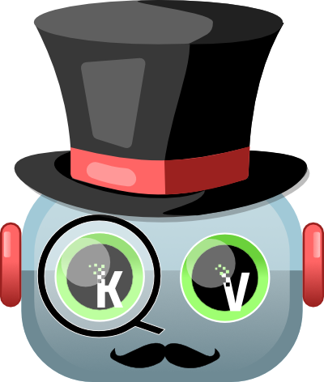

Curated Transformers
====================

**State-of-the-art transformers, brick by brick**

.. note::

   This project is under `active development <https://github.com/explosion/curated-transformers>`_ 🏗️.

**Curated Transformers** is a transformer library for PyTorch. It provides
state-of-the-art models that are composed from a set of reusable
components. The stand-out features of Curated Transformer are:

- ⚡️ Supports state-of-the art transformer models, including LLMs such
  as Falcon, LLaMA, and Dolly v2.
- 👩‍🎨 Each model is composed from a set of reusable building blocks,
  providing many benefits:

  - Implementing a feature or bugfix benefits all models. For example,
    all models support 4/8-bit inference through the
    `bitsandbytes <https://github.com/TimDettmers/bitsandbytes>`_ library
    and each model can use the PyTorch ``meta`` device to avoid unnecessary
    allocations and initialization.
  - Adding new models to the library is low-effort.
  - Do you want to try a new transformer architecture? A BERT encoder
    with rotary embeddings? You can make it in a pinch.
- 💎 Consistent type annotations of all public APIs:

  - Get great coding support from your IDE.
  - Integrates well with your existing type-checked code.
- 🎓 Great for education, because the building blocks are easy to study.
- 📦 Minimal dependencies.

Curated Transformers has been production-tested by `Explosion <http://explosion.ai/>`_
and will be used as the default transformer implementation in spaCy 3.7.

🧰 Supported Model Architectures
--------------------------------

Supported encoder-only models:

- ALBERT
- BERT
- CamemBERT
- RoBERTa
- XLM-RoBERTa

Supported decoder-only models:

- GPT-NeoX
- LLaMA
- Falcon

Generator wrappers:

- Dolly v2
- Falcon

All types of models can be loaded from Hugging Face Hub.

📚 Contents
-----------

.. toctree::
   :maxdepth: 2

   usage
   api
   deployment
   develop
